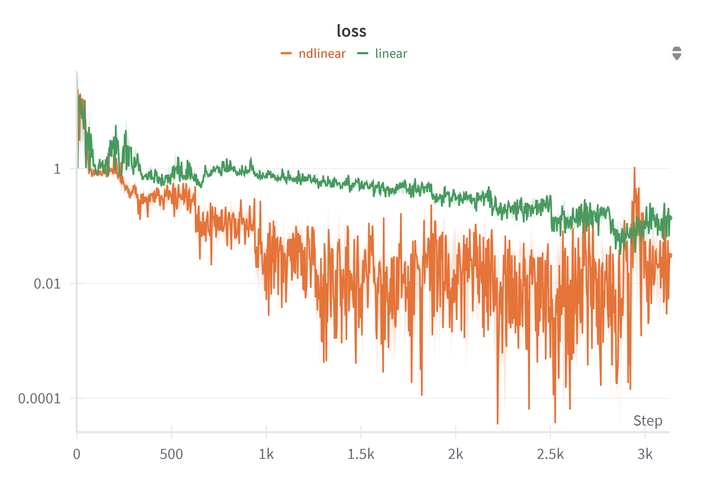

# Sentiment-Analysis-with-Ndlinear
Will update this readme soon with proper documentation, as well as updating the git with the final miscellaneous housekeeping stuff.

# Results
Trained model for 10 epochs with batch size 128, 4 heads in attention, evaluate on 10000 reviews separated out as test set

Baseline: 
Accuracy: 0.7778 
TP: 3949.0 
FP: 1208.0 
FN: 1014.0 
TN: 3829.0 
Average runtime for block: 2.97067 ms 
Average memory usage for block: 487.47 MB 
Total runtime according to tqdm: 25min 59s, 155.97s per epoch

NdLinear variant: 
Accuracy: 0.8528 
TP: 4055 
FP: 564 
FN: 908 
TN: 4473 
Average runtime for block: 4.2829 ms 
Average memory usage for block: 491.46 MB 
Total runtime according to tqdm: 25min 59s, 155.97s per epoch

 