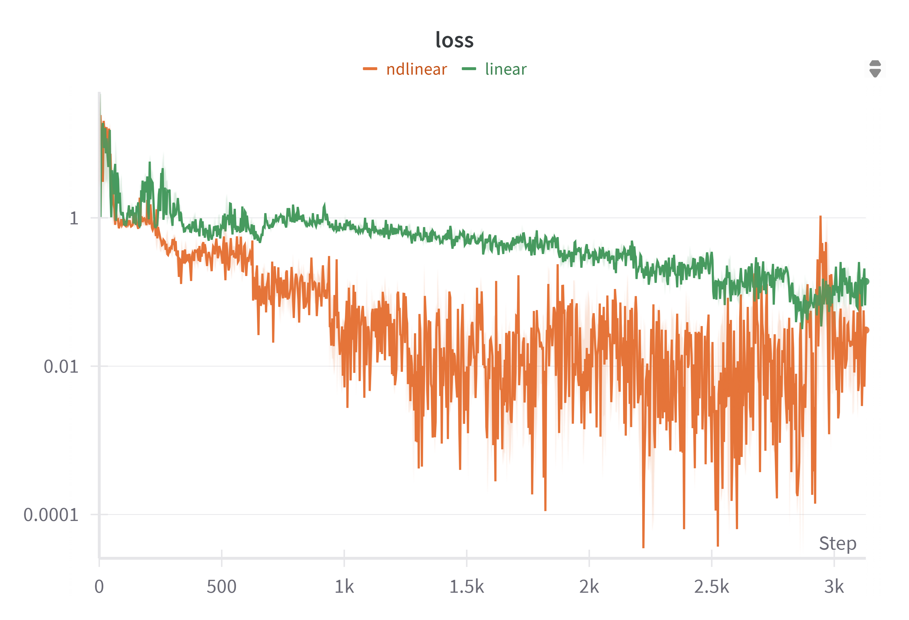

# Sentiment Analysis with Ndlinear
This project trains a lightweight GPT model [[1]](#1) to perform binary sentiment analysis on movie reviews. The model was further modified with Ndlinear, whose results were then compared with the initial baseline.

## Approach
There was a lot of freedom in how I could choose to modify the baseline model with Ndlinear.
What I decided to do was to modify the attention weight layers in the multiheaded self attention.

Initially, the inputs are passed through a linear layer before the attention heads are separated.
The modified version separates the attention heads first before passing the inputs into a ndlinear layer, maintaining the same desired output shape. One can refer to <c>model.py</c> for more details.

The dataset used for training and testing is [IMDB Dataset of 50K Movie Reviews](https://www.kaggle.com/datasets/lakshmi25npathi/imdb-dataset-of-50k-movie-reviews) [[2]](#2). I created a 4-1 train-test split by using Pytorch's <c>random_split</c> function with a fixed seed.

The hyperparameters used for the trainer and model can be found in the main function in <c>trainer.py</c>.

## Results
The following results were obtained from training on a NVIDIA RTX 4070 Super.

| **Model** | **Accuracy** | **Precision** | **Recall** | **Runtime\*/ms** | **Memory Used\*/Mb** |
|:-:|:-:|:-:|:-:|:-:|:-:|
| Baseline | 0.7778 | 0.7658 | 0.7957 | 2.971 | 487.5 |
| Ndlinear | 0.8528 | 0.8779 | 0.8170 | 4.283 | 491.5 |

Table 1: Performance results for both models.*Averaged across attention computations. See <c>forward</c> function in the <c>Block</c> class in <c>model.py</c> for details.

<table>
<tr><th>Baseline</th><th>Ndlinear</th></tr>
<tr><td>

|  | **Predicted+** | **Predicted-** |
| - | :-: | :-: |
| **Actual+** | 3949 | 1014 |
| **Actual-** | 1208 | 3829 |

</td><td>

|  | **Predicted+** | **Predicted-** |
| - | :-: | :-: |
| **Actual+** | 4055 | 908 |
| **Actual-** | 564 | 4473 |

</td></tr> </table>

Table 2: Confusion metrics for both models

<!-- Baseline: 
Accuracy: 0.7778 
TP: 3949.0 
FP: 1208.0 
FN: 1014.0 
TN: 3829.0 
Average runtime for block: 2.97067 ms 
Average memory usage for block: 487.47 MB 
Total runtime according to tqdm: 25min 59s, 155.97s per epoch

NdLinear variant: 
Accuracy: 0.8528 
TP: 4055 
FP: 564 
FN: 908 
TN: 4473 
Average runtime for block: 4.2829 ms 
Average memory usage for block: 491.46 MB 
Total runtime according to tqdm: 25min 59s, 155.97s per epoch -->

Figure 1: Log plot of loss over time for both models

We observe that using Ndlinear significantly improved the performance of the model, supporting the argument that Ndlinear preserves important multidimensional dependencies that normal linear layers discard.

However, we did not get any memory or runtime improvements. This is expected because Ndlinear splits a single linear layer into a few smaller, but sequential linear layers. While theoretically this would reduce the amount of work, this would only translate to improvements for CPUs, whereas GPUs would suffer because we've reduced the amount of potential parallelism. It's possible that cache inefficiencies are also what caused the increase in memory usage even though Ndlinear used less parameters.

## Conclusions

This project demonstrates the strong potential that Ndlinear has to improve model performance, while highlighting a potential area for improvement in terms of parallel computation.

 ## References

<a id="1">[1]</a>
 Andrej Karpathy (2023). minGPT \[Software\]. Github. https://github.com/karpathy/minGPT

<a id="2">[2]</a>
 Maas, A. L., Daly, R. E., Pham, P. T., Huang, D., Ng, A. Y., & Potts, C. (2011). Learning word vectors for sentiment analysis. In Proceedings of the 49th Annual Meeting of the Association for Computational Linguistics: Human Language Technologies (pp. 142–150). Association for Computational Linguistics. http://www.aclweb.org/anthology/P11-1015